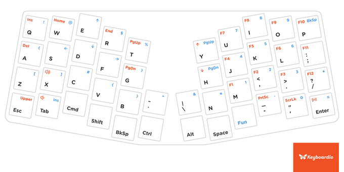
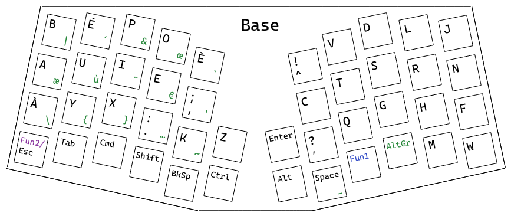
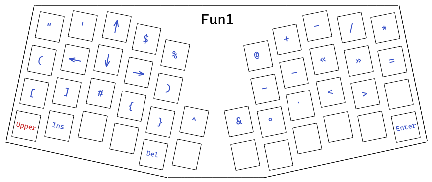
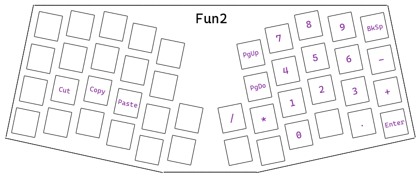
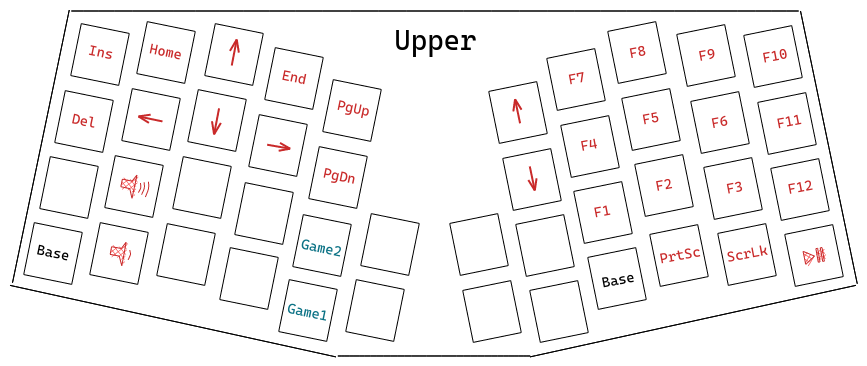
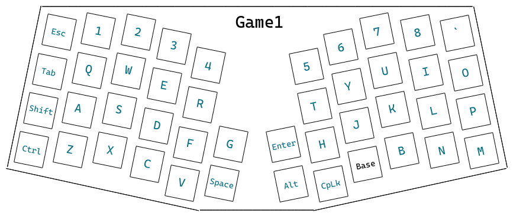
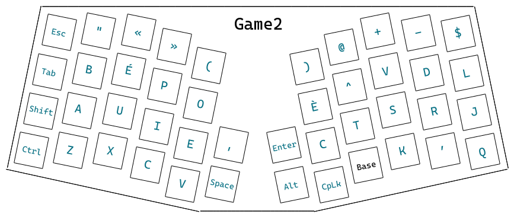

# Atreus Bépo

A simple default Bépo configuration for the Atreus keyboard.

## Introduction

The [Atreus](https://www.kickstarter.com/projects/keyboardio/atreus) is a small mechanical keyboard manufactured by Keyboardio. It has been designed with a qwerty layout in mind, and as it only has 44 keys, many symbols were pushed on what they call "layers". One can shift to a different layer by applying a key modifier.

When using Bépo as the operating system keyboard layout, the Atreus does not translate super well. Some letters are totally missing. Others are located at the same place as symbols on the qwerty layout, and so are shifted to a second layer. That is not convenient. You expect at least to type regular letters using the base layer or you will have to do finger gymnastics to type simple sentences.

Luckily, the Atreus is a configurable keyboard that you can customize. The simplest way to do so it by using [Chrysalis](https://github.com/keyboardio/Chrysalis).

I have been exploring how people were configuring the Atreus with Bépo (see https://bepo.fr/wiki/Atreus), but I did not find something I was pleased with. I am the kind of guy that likes "sane defaults". I realized that tweaking things to make them more tailored for yourself was too tedious. You’d better go with default configurations and be productive doing real things. However, I had to face reality because there was no such thing as a "sane default" configuration for typing on the Atreus with Bépo. The keyboard was already on my desk so I know that this time I could not escape the tweaking, or it would stay unused and soon be covered by dust.

So this repo is to share my take of trying to establish a "sane default" configuration for Bépo. I put quotes on that because I cannot claim to make something that will fit naturally to everyone. But at least, I have tried to organize the letters and symbols without much personal opinion. Here are the few design philosophies that helped me along the way:
- Stay as close as possible to the choices that designers of the Atreus made for the qwerty layout.
- When possible, try to make choices that would satisfy a typical Bépo typist typing on a standard keyboard.
- When no clear path is seen for a choice, prefer usability.

Further down, I will try to explain the choices I made more specifically. But keep in mind that there is never a one-size-fits-all solution that will satisfy all of us. So if you roughly like this layout, just take it as a starting point to do your own configuration. After all, maybe you’ll only have a few tweakings to make, and that will buy you time!

I am also interested in receiving feedback. I’d like to hear what choices other people make, and what changes they would prefer. So feel free to open a discussion on that repo to share your comments/ideas.

All the visual designs in that document were made using [Excalidraw](https://excalidraw.com/). You can load the full Excalidraw project using [atreus.excalidraw](./atreus.excalidraw). Otherwise, all png files were exported by embedding Excalidraw scenes. So you can also simply load a png into Excalidraw, and you will be able to tweak it.

## Prerequisites

This layout has been designed using [version 1.1rc2](https://bepo.fr/wiki/Version_1.1rc2) of the Bépo layout.

On Linux, you can usually enable it with:

```
setxkbmap fr -variant bepo_afnor
```

## Installation

Simply use the file [layout.json](./layout.json) and import it in Chrysalis using the "Layout sharing" feature. 

## Default qwerty layout

For reference, here is the default qwerty layout as designed by the Keyboardio team. As I tried to keep close to this layout, it is handy to have it at hand. You can also find each layer decomposed on the [Atreus](https://www.kickstarter.com/projects/keyboardio/atreus) page.



## Layers

### Base

This is the base layer. My goal here was to make as few changes as possible. I just wanted all regular letters directly accessible on that layer.



- `AltGr` is available using the right thumb, the same as on a regular keyboard.
- `Z` has been added above `Ctrl`.
- `W` has been added at the bottom right corner of the keyboard at `Enter`’s location. I first placed it above `Alt` (symmetrical to `Z`), but it was not convenient when typing in english (for instance `W`, then `H` for "when" or "where"). So I had to made the hard choice of swapping it with `Enter` (hence diverging from a choice made by the Keyboardio team). If you don’t happen to type in english, you can swap them back.
- `M` happens to land at the bottom right corner without any changes.
- `Fun` has been renamed to `Fun1`. I’ll explain later.
- `Fun2` has been introduced on the same key as `Esc` when holding it.

You can note that `ç` does not exist. 44 keys is not a lot and I could not find a suitable place for it, so I decided that I would use `AltGr + c` to type it (using Bépo 1.1rc2). I did not want to push letters to a `Fun` layer. To me, `Fun` is for symbols.

### Fun

Initially, the Atreus only has one `Fun` layer for numbers and special characters. However, almost no special character can be placed on the base layer in Bépo because it has more letters. And it also has more of them (`–`, `—`). So numbers and special characters did not fit together on the same layer. So the idea was to split into two `Fun` layers (`Fun1` and `Fun2`).

#### Fun 1



This `Fun1` layout it reached the same way as the `Fun` layer in qwerty. The left part of the layer almost did not change.

- `"` replaces `!` because `!` can be typed on the base layer. On top of that, `"` ends up being physically at the same place as on a regular Bépo keyboard (same key as `1`).
- `'` is right beside `"`. They are relative, so having them next to each other makes sense. Note that on 1.1rc2, the typographic apostrophe replaces the regular one. But the regular is still needed when programming for instance.
- `<` and `>` are at the same place as on the base layer of a qwerty layout.
- `@`, `+`, `-`, `/` and `*` are at the same place as on a regular Bépo keyboard (same keys as `6`, `7`, `8`, `9` and `0`).

Other characters under the right hand are placed without applyng specific rules.

#### Fun 2



This `Fun2` layout is reached by holding `Esc` on the base layout with the left hand. The right part of the layer is the exact same one as the right part of the `Fun` layer of the qwerty layout (numbers).

As there was not much to add on the left part of this layer, I opted for the addition of cut, copy, paste keys at the same place as on a qwerty/azerty layout. This is handy to copy/paste with the left hand when using the mouse on the right hand for instance.

### Upper

This layer hasn’t changed at all except the layer modifiers gaming layers.



## Optional layers

### Game

Those layers are totally optional but can be practical for gamers.

Historically, games are played with W, A, S, D on a qwerty layout plus a few keys easily reachable around them. But if you don’t use the qwerty layout or if you have a fancy keyboard which wasn’t made for gaming (e.g. `Ctrl` on thumb), it can become complicated to play games. You will probably have to make tons of remappings to make it yours. I personally always prefer to avoid doing that.

In reality, game developers have two choices when listening for typed keys:
- Letters
- Scancodes

If a game listens to letters and `W` is "moving forward", well, you will have to type a key on your keyboard that will translate to `W` if you want to move. If you are not a qwerty typist, you are screwed and you are good for remappings. You can also switch your operating system layout to qwerty each time you start a game, but that’s not convenient in games where you can type words. You want to chat with other players using Bépo for instance.

However, more recent games listen for physical scancodes. Say for instance that to move forward, the game expects that you type the second key on the top row. This will be `W` in qwerty, and `É` in Bépo. This solution is more robust and should normally work accross multiple keyboard layouts. However, when you have an ergonomic keyboard such as the Atreus, this might not be sufficient. Keys modifiers are on the thumb for instance, so you will lose your habits in games. What we want in the end is to have your fingers positioned physically at the same place as a "standard" keyboard (e.g. `Ctrl` at the bottom left).

Those two following layers were made for that purpose. The first one is to be used when a game listens to letters, while the second is for scancodes. If you don’t know what the game expects, just try them both and you will quickly see.

You can enable them from the `Upper` layer with the left hand. Note that if while gaming you need a key that does not exist on the layer, you can quickly swap to the base layer and then come back. Same if you want to write words.

#### Game 1



#### Game 2


